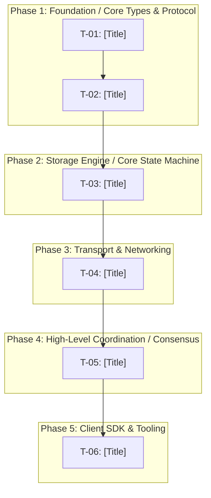

# Engineering Task Breakdown: [Project Name]

**Source TRD:** `[Path to trd.md]`  
**Status:** Ready for Detailing & Implementation  
**Architectural Archetype:** `[Systems & High-Throughput Engine | Enterprise Web & Microservices | Hybrid]`  
**Target Language/Stack:** `[e.g. Rust, Go, TypeScript, Python]`  
**Date:** [YYYY-MM-DD]  

---

## 1. Execution Dependency Graph

Directed Acyclic Graph (DAG) visualizing the topological execution order from foundational layers up to user-facing interfaces:



---

## 2. Task Summary Table

Topologically sorted summary of all engineering tasks:

| Task ID | Module / Crate / Package | Task Title | Depends On | Complexity |
| :--- | :--- | :--- | :--- | :--- |
| **T-01** | `protocol` / `types` | [Task Title] | None | Low |
| **T-02** | `storage` / `engine` | [Task Title] | T-01 | Medium |
| **T-03** | `storage` / `compaction` | [Task Title] | T-02 | High |
| **...** | ... | ... | ... | ... |

---

## 3. Detailed Task Cards

Each task card represents an atomic, independent, and verifiable unit of engineering work:

### Phase 1: [Phase Name from TRD]

#### T-01: [Task Title]
- **TRD Reference**: `Section [X.X] ([Section Title])`
- **Module / Target Path**: `[e.g. crates/rustykv-protocol or internal/storage]`
- **Objective**: [1–2 sentences stating the concrete technical goal of this task]
- **Target Files**:
  - `[NEW] path/to/file.ext`
  - `[MODIFY] path/to/existing.ext`
- **Key Signatures & Structs**:
  ```rust
  // Primary interfaces, traits, structs, or error enums to introduce
  ```
- **To Do / Implementation Steps**:
  1. [Implementation step 1]
  2. [Implementation step 2]
  3. [Implementation step 3]
- **Predecessors / Depends On**: [None | T-NN]
- **Verification & DoD**:
  - [ ] Compiles cleanly with zero compiler/linter warnings (`cargo clippy` / `golangci-lint` / `eslint`).
  - [ ] Automated test command passes: `[specific automated test command]`.
  - [ ] Edge cases and failure conditions validated via test assertions.

#### T-02: [Task Title]
...

---

### Phase 2: [Phase Name from TRD]
...
